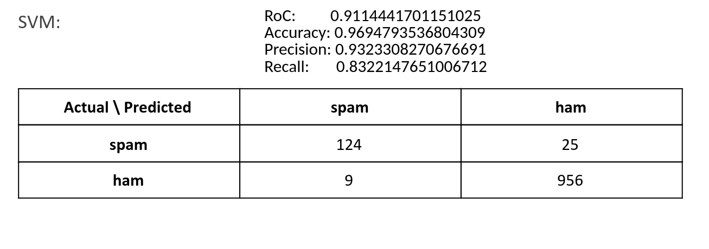

# Scalable Data Science- Technical University of Berlin

The goal of the project is to process various data using various data mining tasks with Scala and Apache Spark.

### Tools
* Language: Scala, Java, Python
* IDE: IntelliJ IDEA, Google Colab
* Build tool: Maven
* Apache Spark, Spark SQL and GeoSpark

The project is decomposed into the following sub tasks

### [1. Classification](https://github.com/htefera/Scalable-Data-Science-Assignment-2/tree/master/Classification)

The goal is to classify email texts as spam or not. To do so, we use logistic regression and SVM algorithms and compare their accuracies. 

Approach

1. We read the CSV files as dataframe and add a column “spam” to denote if the read record is spam or not
1. We union training records for spam and no spam into a single dataframe, the same operation is done for the training set too.
1. We normalize the email text, we apply normalization as we term frequency as the basis
for classification and having discrete email addresses,
2. We construct a pipeline to apply the transformation. We perform word tokoneziation the words and stop word removal operation. We use a hashing term frequency transform to count the word occurrences and we calculate the inverse document frequency and this forms our feature vector.
3.  We train a Logistic Regression and SVM model with transformed training data
4.  We use the testing set to make predictions using the model
5.  We compute RoC, Accuracy, Precision and Recall metrics and display a confusion matrix for the benefit of the user

### [2. Clustering](https://github.com/htefera/Scalable-Data-Science-Assignment-2/tree/master/Clustering)
### [3. Recommednation System](https://github.com/htefera/Scalable-Data-Science-Assignment-2/tree/master/Recommendation%20Systems)
### [4. Spatial Data Analysis](https://github.com/htefera/Scalable-Data-Science-Assignment-2/tree/master/Spatial%20Data%20Analysis)

